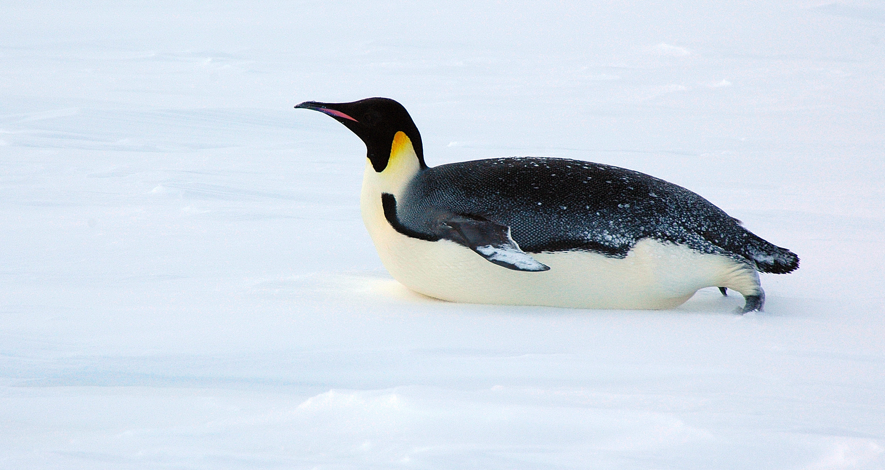

# ColdStart: how it all started

This is the story of two penguins who are taking their first steps as small business owners. They plan to open an ice cream parlor and do home deliveries, under the **ColdStart** 🍨 brand. But how did it all begin?

*Image from [Denis Luyten](https://commons.wikimedia.org/wiki/File:2007_Snow-Hill-Island_Luyten-De-Hauwere-Emperor-Penguin-56.jpg)*

## A hidden gem

The story begins in January 1937, during the Antarctic summer, when [Ingrid Christensen](https://en.wikipedia.org/wiki/Ingrid_Christensen)'s is the first woman to set foot on the southern arctic mainland. While exploring the coldest parts of the planet, even the smallest snack can be a lifesaver. In case of emergencies, polar explorers will [leave caches of food and supplies](https://www.smithsonianmag.com/smart-news/arctic-explorers-uncover-60-year-old-food-stash-180956936/) along their return route. But they don't always make it back to retrieve them and so they're left behind.

It was on a sunny day that the penguins' great grandfather was shuffling back home after foraging for fish, when something caught his eye. Overnight, high winds around the Southern Pole had uncovered terrain which had been covered with snow for decades. His [curious nature](https://www.bbc.com/news/av/science-environment-43338184) took over and, as he cautiously moved closer, he recognized a heap of metal cannisters containing biscuits, milk powder, and honey. He quickly grabbed all items and rushed back home, picturing the looks of excitement on the children's faces. It had been a particularly long and harsh winter and summers are already quite short on this frozen continent.

## A (n)ice suprise

Back home, these unexpected treats came as a pleasant surprise. Soon mother penguin put a pot on the stove, and prepared some milk. What better way to warm your flippers than to sit under the midnight sun with a cup of hot milk with honey! The kids were playing by the [waterfront](https://www.nasa.gov/audience/forstudents/k-4/stories/nasa-knows/what-is-antarctica-k4.html), so mother lined up their favorite mugs on the outside table and signaled the penguin chicks to return back home. 

Suddenly the [polar vortex](https://en.wikipedia.org/wiki/Polar_vortex) picked up, resulting in an immediate drop in temperature. By the time the kids got back, their milk had turned to ice, with their spoons frozen in-place. And so the first Antarctic ice cream saw the light of day! Word spread quickly and soon, the family milk-and-honey ice cream became everyone's favorite dessert among the penguin colony!

Over time, the mother further refined the ice cream, making it even more delicious. The recipe remained a well-kept family secret, that was passed on from one generation to the next.

## A cold start

Fast-forward to the winter of 2020, the pinguin siblings' grandmother has retired. She leaves them the ice cream recipe that has been in the family for many generations. Given the huge success of the ice cream, both penguins spot a business opportunity! What if they'd start an ice cream business 🍧? More and more researchers and tourists are visiting Antarctica and an ice cream parlor and home delivery service might well be a hit. 

They decide to name their business 🧊 **ColdStart** 🧊 and start working on their business plan. The launch date will be **February 22, 2021**, smack in the middle of the Antarctic summer. The plan is to start with deliveries to the [research stations](https://en.wikipedia.org/wiki/Research_stations_in_Antarctica) on the mainland, and to run an ice cream parlor in the local penguin settlement. Deliveries to the nearby islands should soon follow, and global expansion is planned for 2023.

They have the skills to make the ice cream, having watched their mother and grandmother prepare it with love and dedication. However, they have no clue how to operate the IT infrastructure for managing a business. They're now calling on you for help!

---

## Fun facts

> **Why do Penguin only live in Antarctica?**
> There are excellent reasons that penguins live in Antarctica: Antarctica is the most beautiful place for their accommodation. Antarctica is the *coolest* region on earth. The place has a very small human population.

Check these other [fun facts](https://global.hurtigruten.com/destinations/antarctica/inspiration/wildlife/fun-facts-about-the-penguins-of-antarctica/) to learn more about penguins of Antarctica.
