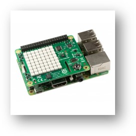

# ColdStart Challenge

What better time to start an ice cream business 🍧 than the winter season?! That's what our penguin siblings thought when they launched their 🧊 **ColdStart** 🧊 home delivery service. However, to get their new business off the ground, they need to put an IT infrastructure in place for hosting a website, to start accepting customer orders, and track their deliveries. **And that's where they need your help!**

Enter the **ColdStart Challenge**! Through a series of **6 coding challenges** you will learn and explore several Microsoft technologies and gain hands-on experience, all from the comfort of your home. Your goal will be to build the software components to get the penguins' business up-and-running before the summer season kicks off.

The ColdStart Challenge is brought to you by the **Microsoft developer community** in collaboration with Microsoft, bringing together 3 local user groups: [AZUG](https://azug.be), [VISUG](https://visug.be) and [MADN](https://madn.be).

*How does it work?* Starting **February 22**, we will be releasing a new coding challenge every fortnight, on our GitHub repo. Each challenge will have a specific topic (e.g. web development, data and AI, Kubernetes, serverless, etc.). You will then have two weeks to complete the exercise, and to post your solution to our GitHub repo.

Did we mention that you can **win something** 🎁? If you're one of the first 40 participants to complete 3 of the first 5 coding challenges, you'll receive an IoT device that will help you complete the last, IoT-based challenge!

*What's next?* Keep an eye out for updates on https://aka.ms/coldstartchallenge and Twitter ([#coldstartchallenge](https://twitter.com/search?q=%23coldstartchallenge)).
