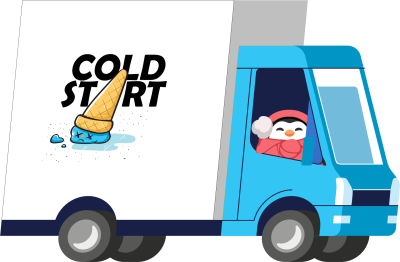
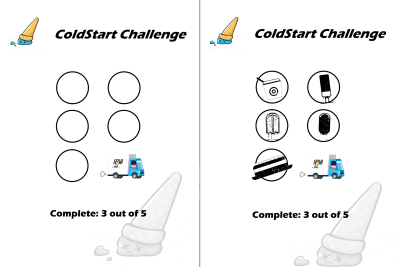
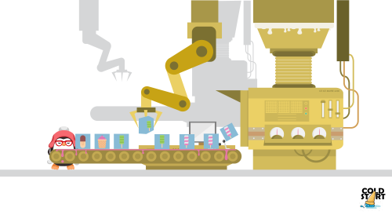

# ColdStart Challenge

Welcome to the 🧊 **ColdStart coding challenge** 🧊! In this series you will use your cloud development skills to help our penguin siblings start up their ice cream parlor and delivery service 🍨.

The goal of this initiative is to let you explore and get hands-on experience with some of the [Microsoft Azure](https://azure.com) cloud services, through a series of **fun coding challenges**. 
Each challenge will build on the previous one and will focus on a specific technology topic. You can expect to learn about hosting web applications, building chatbots, different data services, AI, containers, serverless, and IoT.

We will release a new coding challenge **every fortnight**, which you can then work on by yourself or you can team up with your peers. After two weeks we'll then share the solution to the challenge. So, if you skipped one excercise you can jump back in with the next. 

There are **6 coding challenges** in total and of course we hope you'll join for all of them! If you're one of the first 40 participants to **complete 3 of the first 5** coding challenges, you'll **receive an IoT device** that will help you complete the last, IoT-based challenge!

This coding challenge is being organized in a collaboration between Microsoft and the developer community:

* [AZUG](https://azug.be)
* [MADN](https://madn.be)
* [VISUG](https://visug.be)

> 📣 Share your feedback and tell your friends about this program, on social media [\#coldstartchallenge](https://twitter.com/search?q=%23coldstartchallenge)!

> 📰 Stay updated on the latest Microsoft Developer news through our [Microsoft.Source newsletter](https://azure.microsoft.com/en-us/resources/join-the-azure-developer-community/).

## Challenges 💻

| Date | Challenge | Description | Solution |
| ---- | --------- | ----------- | -------- |
| Feb 22, 2021 | [Challenge 1](./challenges/challenge1/README.md) | Getting ColdStart online 🌎 | [Solution 1](./challenges/challenge1/finished) |
| Mar 8, 2021 | [Challenge 2](./challenges/challenge2/README.md) | Getting serious about Data 📂 | [Solution 2](./challenges/challenge2/finished) |
| Mar 22, 2021 | [Challenge 3](./challenges/challenge3/README.md) | Fire up the production lines 🏭 | |
| Apr 5, 2021 | Challenge 4 |  | |
| Apr 19, 2021 | Challenge 5 |  | |
| May 3, 2021 | Challenge 6 |  | |

## What's the back story of ColdStart?

This is the story of two penguins who are taking their first steps as startup founders. They are planning to begin an ice cream parlor and home delivery service, called **ColdStart** 🍨.

Six months ago, the penguin siblings' grandmother retired. She left them the ice cream recipe that has been in the family for many generations. Now both penguins decided to start an ice cream business 🍧! However, they have no clue of how to build and host a website, process customer orders and track and trace the home deliveries. They're calling on you for help!

You will use the Microsoft Azure cloud services to build all of the IT infrastructure needed for running their entire business. 

*If you're interested in the full history of the penguins and how ColdStart came to be, check the [back story](./BackStory.md).*

---

## Questions? Comments? 🙋‍♀️

If you have any questions about the challenges, feel free to open an **[ISSUE HERE](https://github.com/ColdStart-Challenge/ColdStart-Challenge-2021/issues/new/choose)**.

You can also reach us on Twitter by mentioning the [\#coldstartchallenge](https://twitter.com/search?q=%23coldstartchallenge) hashtag.

## Contributing 🚩

This project welcomes contributions and suggestions. Most contributions require you to agree to a Contributor License Agreement (CLA) declaring that you have the right to, and actually do, grant us the rights to use your contribution. For details, visit https://cla.opensource.microsoft.com.

When you submit a pull request, a CLA bot will automatically determine whether you need to provide a CLA and decorate the PR appropriately (e.g., status check, comment). Simply follow the instructions provided by the bot. You will only need to do this once across all repos using our CLA.

This project has adopted the [Microsoft Open Source Code of Conduct](https://opensource.microsoft.com/codeofconduct/). For more information see the [Code of Conduct FAQ](https://opensource.microsoft.com/codeofconduct/faq/) or contact [opencode@microsoft.com](mailto:opencode@microsoft.com) with any additional questions or comments.
