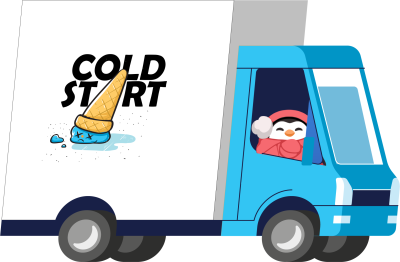

# ColdStart Challenge 5: Forecasting demand 🔮

Welcome to the 🧊 **ColdStart coding challenge** 🧊! In this series you will use your cloud development skills to help our penguin siblings with starting up their ice cream parlor and delivery service 🍨. Learn more about the penguin's [backstory](../../BackStory.md).



Learn more about how it works and how you can **win something** [here](../../README.md).

In this **fifth coding challenge**, your goal is to build a machine learning model that will allow forecasting the customer demand for the upcoming period. This will allow scaling the factory production lines to fullfil all orders without delays. You will have **two weeks to complete** this exercise.

> 📣 Share your feedback and tell your friends about this program on social media [\#coldstartchallenge](https://twitter.com/search?q=%23coldstartchallenge)!

---

## Challenge Description 🐧

In the fifth coding challenge we will focus on **building and deploying a machine learning model to forecast customer demand**. Estimating how many ice creams will be ordered in the coming days and weeks allows for better a better resource planning in the factory and the delivery process. This challenge consists of **two objectives**.

The first objective is to **create and train a machine learning model using the [Azure Machine Learning service](https://docs.microsoft.com/en-us/azure/machine-learning/overview-what-is-azure-ml?ocid=aid3027557)**. With Azure ML you can create models regardless of your skill level with machine learning. If you're not familiar with ML algorithms at all, you could leverage **[Automated ML](https://docs.microsoft.com/en-us/azure/machine-learning/concept-automated-ml?ocid=aid3027557)**. Alternatively you could make use of the **Designer**'s drag-and-drop visual environment to create your model. If you are comfortable to write an ML model yourself, your best option might be **Jupyter Notebooks** hosted in Azure ML.

In the `starter` folder you will find a [CSV file](./starter/data/coldstart-historical-sales.csv) with over 100,000 records of historical sales data. Below you can find the description of the data fields. Your goal will be to **forecast the `count` field for a date in the future**.

```
Data Fields
-----------
datetime - hourly date + timestamp  
season -  1 = spring, 2 = summer, 3 = fall, 4 = winter 
holiday - whether the day is considered a holiday
workingday - whether the day is neither a weekend nor holiday
weather
  1: Clear, Few clouds, Partly cloudy, Partly cloudy
  2: Mist + Cloudy, Mist + Broken clouds, Mist + Few clouds, Mist
  3: Light Snow, Light Rain + Thunderstorm + Scattered clouds, Light Rain + Scattered clouds
  4: Heavy Rain + Ice Pallets + Thunderstorm + Mist, Snow + Fog 
temp - temperature in Celsius
atemp - "feels like" temperature in Celsius
humidity - relative humidity
windspeed - wind speed
count - number of total sales
```

> Note: we have used the [Bike Sharing demand Kaggle dataset](https://www.kaggle.com/c/bike-sharing-demand) as a basis for our dataset.

The second objective is then to **take the trained model and deploy it as a REST endpoint**. With Azure Machine Learning you can easily package your model as a Docker container and deploy to for example Azure Kubernetes Service or Azure Container Instances.

## Challenge Objectives 🥇

In this fourth coding challenge you will build the delivery applications and will need to unlock the following achievements:

1. Build and train an ML model using Azure Machine Learning service
2. Deploy the trained model to AKS or ACI

## Resources

- [Historical sales data](./starter/data/coldstart-historical-sales.csv)

## Learning Resources 📖

- **Azure Machine Learning**
  - [What is Azure Machine Learning](https://docs.microsoft.com/en-us/azure/machine-learning/overview-what-is-azure-ml?ocid=aid3027557)
  - [What is automated machine learning](https://docs.microsoft.com/en-us/azure/machine-learning/concept-automated-ml?ocid=aid3027557)
  - [Tutorial to forecast demand using Automated ML](https://docs.microsoft.com/en-us/azure/machine-learning/tutorial-automated-ml-forecast?ocid=aid3027557)
  - [Deploy machine learning models](https://docs.microsoft.com/en-us/azure/machine-learning/how-to-deploy-and-where?tabs=azcli&ocid=aid3027557)
  - [Deploy a model to Azure Container Instances](https://docs.microsoft.com/en-us/azure/machine-learning/how-to-deploy-azure-container-instance?ocid=aid3027557)
  - [Use automated machine learning (MS Learn)](https://docs.microsoft.com/en-us/learn/modules/use-automated-machine-learning/?ocid=aid3027557)

## Tools Used 🚀

- ✅ [Visual Studio Code](https://code.visualstudio.com?ocid=aid3027557)
- ✅ [Get an Azure free account](https://azure.microsoft.com/en-us/free/?ocid=aid3027557) or DM us [on Twitter](https://twitter.com/msdev_be) and we'll provide you with a 30-day Azure Pass (depending on availability).
- ✅ [GitHub account](https://github.com/).

---

## Submit your solutions? 🔥

Within 2 weeks of making the coding challenge public, **submit your solution as a Challenge Solution Submission ISSUE** to this GitHub repository.

 1. Create your own Github repo with your solution for that challenge or fork this repo.
 2. Create a new [Challenge Solution Submission ISSUE](https://github.com/ColdStart-Challenge/ColdStart-Challenge-2021/issues/new/choose) in our repo for each challenge and fill all the details.
 3. Submit the issue.


## Questions? Comments? 🙋‍♀️

If you have any questions about the challenges, feel free to open an **[ISSUE HERE](https://github.com/ColdStart-Challenge/ColdStart-Challenge-2021/issues/new/choose)**.

You can also reach us on Twitter by mentioning the [\#coldstartchallenge](https://twitter.com/search?q=%23coldstartchallenge) hashtag.
